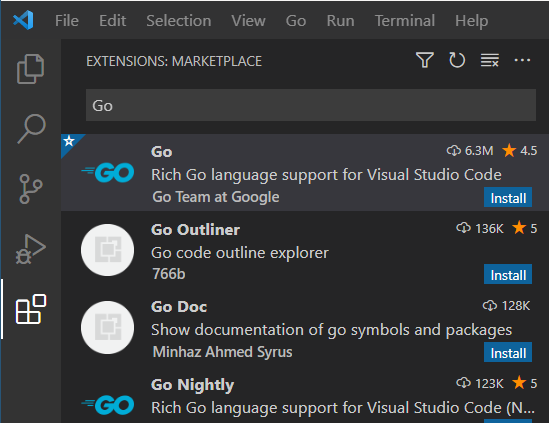
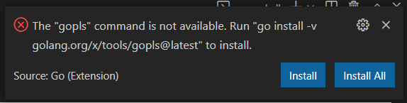

## {} Install Go

To install Go follow the official installation instructions at https://go.dev/doc/install. After the installation you can verify if everything works by running `go version` in a terminal.


## {} Install Editor

Of course you need an editor to edit the Go source files. There are no special requirements for the editor so you can use whatever editor you are familiar with.
However, among Go developers certain editors are more popular than others and hence there is more tooling and plugins available for them. According to the [Go Developer Survey 2020](https://go.dev/blog/survey2020-results) the two most popular editors are:

* VS Code (41%)
* GoLand / IntelliJ (35%)

For this course it doesn't matter which editor you use. If you are not sure which editor to choose, we recommend you use VS Code. It is available for free and there is an official Go extension.

{}
If you don't use VS Code you can skip this section. This section will briefly describe how to install VS Code and the recommended extension for Go development:

* Download and Install VS Code from https://code.visualstudio.com/
* Start VS Code and open the extensions menu on the left side
* Search for the Go extension and install it



The first time you open a Go file the Go plugin will show a warning to you that certain tools are missing. Click on "Install All" to install all missing tools. This will take some time.


{}


## {} Hello World

Now we want to build our first Go program which prints `Hello, World!`.
To create a new Go project we create a new directory and initialize a Go module in it

```shell
mkdir hello
cd hello
go mod init hello
```

Then we create a new file `main.go` and put the following code in it:
```golang
package main

import "fmt"

func main() {
	fmt.Println("Hello, World!")
}
<!--output-->
Hello, World!
```

This file contains the main function which is the entrypoint for our application. We will learn about packages and the project structure in general later in this course.

Open a terminal and make sure you are in the `hello/` directory. Execute the following commands to build and run your program:

```shell
go build

# Linux / Mac
./hello

# Windows
.\hello.exe
```
